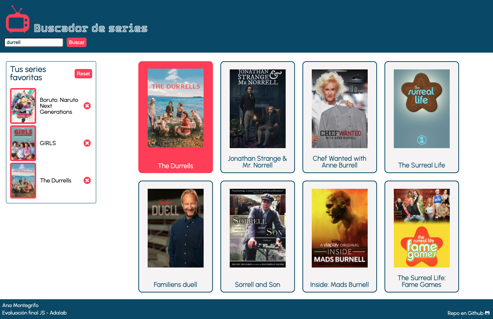

# Evaluación final Javascript

Este es el trabajo de evaluación final de Javascript en Adalab. Consiste en una web de consulta de series utilizando la API de búsqueda de series de [TV Maze](https://www.tvmaze.com/shows).

El proyecto está creado sobre el Starter Kit de Adalab, y se trata de una web que nos permite buscar series y añadirlas a un listado de favoritas. Este listado se guarda en local, para poder acceder a él al recargar la página.

Esta es la apariencia de la web:



### Cómo trabajar con este proyecto

> **NOTA:** Necesitas tener instalado [Node JS](https://nodejs.org/)

1. Descarga el proyecto en tu equipo e inclúyelo en tu propio repositorio.
2. Instala las dependencias locales ejecutando en la terminal el comando:

```bash
npm install
```

3. Arranca el proyecto ejecutando el siguiente comando:

```bash
npm start
```

Esto tendrás que hacerlo cada vez que te pongas a programar. Después de esto puedes empezar a editar los ficheros dentro de la carpeta `src/`

Los siguientes pasos puedes consultarlos en los vídeotutoriales de [**Adalab**](https://www.youtube.com/c/Adalab)

### Estructura del proyecto

Esta es la estructura de carpetas:

```
src
 ├── html
 |  ├── partials
 |  └── index.html
 |
 ├── images
 |
 ├── js
 |	├── partials
 | 	└── main.js
 |
 ├── scss
    ├── core
    ├── layout
    ├── pages
    └── main.scss

```

### Tecnologías y recursos utilizados para el proyecto:

- HTML y preprocesador SASS con sintáxis SCSS
- Node.js
- Markdown
- Gulp
- Javascript
